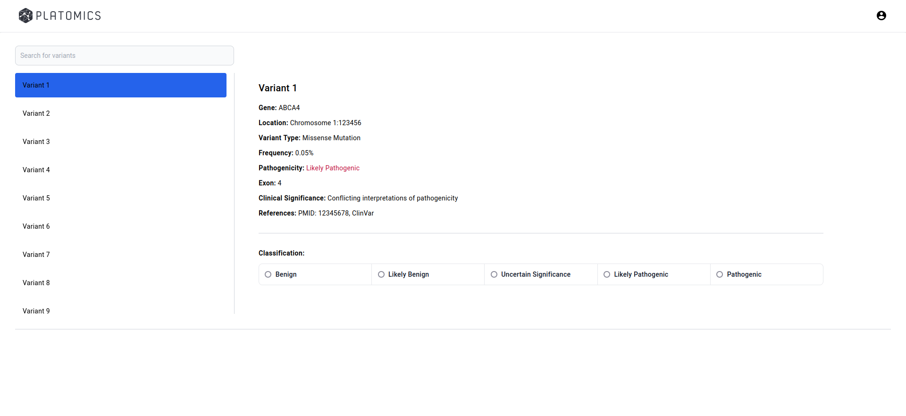

# Platomics Angular Challenge

In this take home assignment we would like you to implement a basic UI which makes it possible to view a relatively large dataset.

Some products that Platomics is working on is related to Next Generation Sequencing(NGS). In simplified terms, one of the goals of NGS is to detect mutations in a patients genome and classify them in terms of severity. These mutations are called variants. Since all humans are different we will always find variants so it is important to understand the impact of a variant and how high our confidence in detecting it is.
The data which we use as an input for our variant detection(analysis) is called a sample. Samples are the output of a genetic sequencing machine(for example the Illumina HighSeq X) and are just a collection of strings which represent the bases(adenine (A), cytosine (C), guanine (G), thymine (T)) from a sub-part of a gene. A single analysis will return on average 100.000 variants.

## Technology stack ##

This take home assignment is focused on your frontend skills, particularly with Angular. This is why there is no backend or database part. Angular version 16 is used with NGXS for state management and Tailwind plus Material for styling.

## Goal of the take home assignment ##

We would like you to implement a simple UI to view a list of variants. When clicking on a variant a detail view of this variant should open next to the list. It also should be possible for the user to provide a manual classification of a variant. Classification and pathogenicity are to separate values so a classification choice should not update the pathogenicity. The classification states are:
* 'Benign'
* 'Likely Benign'
* 'Uncertain Significance'
* 'Likely Pathogenic'
* 'Pathogenic'
* and `undefined` or `null`

The enum for the classification states can be found in `./store/variants.state.ts`.
This classification needs to be persisted in the applications state management. It should be possible to reduce the current list of variants by searching via variant name in an input field. A new variants batch should be loaded into the applications state management if the user either scrolls to the end of the variant list or if they click on a button located at the end of the list.

We expect that this your provided implementation can handle 100.000 variants at the same time.

The below screenshot can be taken as reference but it is not needed to replicate this exact design.

## Hints ##

The variant interface is already defined in `./store/variants.state.ts`. In this store is also a utility function called `generateVariantBatch` with generates a batch of 10.000 variants.